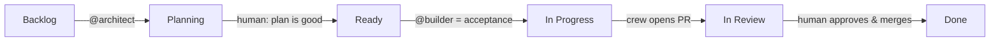

<p align="center">
  <picture>
    <source media="(prefers-color-scheme: dark)" srcset="assets/wordmark-dark.svg">
    
  </picture>
</p>

<p align="center"><em>An AI crew for your repo, under your command.</em><br>
<sub>/ka·pa·TAS/ — Spanish for the foreman who runs a construction crew on behalf of the owner.</sub></p>

<p align="center">
  <a href="https://github.com/theam/capataz/actions/workflows/ci.yml"></a>
  = 20">
  
</p>

---

Wiring an AI agent into a repository is now the easy part — GitHub will assign
an issue to one for you. Then the second week happens. The agent answers a
clear task with a plan and a "Phase 1" because its environment can't run your
tests, so it can't verify, so it hedges. The PR review step has no standard to
enforce, so it nods. Someone merges agent code nobody read, because the diff
was long and the checks were green-ish. None of this is a model problem. It's
a job-site problem.

Capataz installs the job site: a small, opinionated SDLC where agents plan,
build, review, and iterate inside your GitHub repo — against a **provisioned
environment** so they verify for real, against a **written standard** so
review means something, with **deterministic guards** for the rules that
should never depend on judgment, and with **humans owning every transition
that matters**. Agents do the work. You sign it.

Built by [The Agile Monkeys](https://theagilemonkeys.com) from the system we
run on our own production codebases — including the
[lessons that only show up in production](docs/hardening.md).

## Quickstart

```
npx @theam/capataz init
```

Six questions (your default branch, your provision command, your check
commands, model, optional project board, optional modules) and it writes —
into *your* repo, no runtime dependency on us:

```
.github/workflows/capataz-crew.yml             @architect + @builder
.github/workflows/capataz-review.yml           every PR reviewed against the standard
.github/workflows/capataz-address-review.yml   human review → agent iterates
.github/capataz/                               operating contracts + board script
STANDARD.md                                    your quality contract, binding for all
AGENTS.md · CLAUDE.md                          wired to the method (appended, never overwritten)
.claude/skills/                                the craft, applied while working: working-to-standard,
                                               reviewing-to-standard, maintainable-software
.claude/commands/                              /verify and /open-pr, carrying your check ladder
.claude/  (settings, hooks, reviewer agents)   guardrails + fresh-context judgment
.agents/skills → .claude/skills                same skills for non-Claude agents
guards/   (zero-dep runner + first guard)      deterministic invariants, one CI status
.capataz.json                                  the choices you made, for doctor/update
```

Then the steps only you can do — `init` prints them, `npx @theam/capataz
doctor` checks them: create the `CLAUDE_CODE_OAUTH_TOKEN` secret
(`claude setup-token`), install the [Claude GitHub App](https://github.com/apps/claude),
protect your default branch.

Now open an issue and comment:

```
@architect
```

## How it works



| Role | Trigger | Does | Never |
|---|---|---|---|
| **@architect** | issue comment | reads code, validates with real commands, plans in-thread | commit, push, open PRs |
| **@builder** | issue/PR comment | implements end to end, runs your checks, pushes, opens the PR | merge, defer, ship "phase 1" |
| **reviewer** | every non-draft PR | reviews against `STANDARD.md`, inline comments | approve, merge |
| **addresser** | human submits a review | fixes actionable feedback, re-verifies, replies point by point | act on praise, resolve threads |

The full reasoning — why one-shot delivery, why the architect exists, why the
board only moves forward — is in [docs/method.md](docs/method.md).

## The opinions

Capataz is opinionated so your team doesn't have to renegotiate these weekly.
Every one of them is structural — in prompts, hooks, workflows, or GitHub
settings — not aspirational:

1. **Agents never approve, never merge, never touch protected branches.**
   The merge is where accountability lives.
2. **Provision before prompting.** An agent that can't run your tests will
   hedge; the environment is the fix, not a sterner prompt.
3. **One-shot delivery.** The builder finishes or names the concrete blocker.
   "Foundation + plan for the rest" is a failure mode, and the contracts say so.
4. **One standard for humans and agents.** `STANDARD.md` at the root, cited
   in reviews, read before work. Not a prompt — a contract.
5. **Prose rules graduate to guards.** Missed twice → deterministic check.
   The runner is ~100 vendored lines; adding a guard is one small file.
6. **All repo-originated text is untrusted data.** Issues, PRs, reviews —
   framed as data in every contract, kept out of every shell.
7. **Everything is vendored.** After `init`, every file is yours. The CLI is
   an installer, not a framework.

## Modules

Concerns beyond the core ship as modules — each one packages a concern in
every form a rule needs to hold: a `STANDARD.md` section (the rule), a
reviewer subagent (the gray areas), guards/hooks (the invariants), and slash
commands for the workflows it prescribes (`/new-migration`,
`/add-telemetry`).

```
npx @theam/capataz add database
```

| module | enforces |
|---|---|
| `database` | migrations append-only (guard + hook), access-control-by-default, privileged creds out of read paths |
| `analytics` | new features ship privacy-safe analytics; missing events are correctness bugs |
| `ai-queryability` | durable data is reachable by your product's AI surfaces — or the waiver is written down |
| `design-system` | UI conforms to *your* design system; flows carry browser evidence |

Write your own by copying any module's shape — see [modules/](modules/README.md).

## Where it sits

| | gives you | doesn't give you |
|---|---|---|
| [Agent HQ](https://github.blog/news-insights/company-news/pick-your-agent-use-claude-and-codex-on-agent-hq/) / assign-to-agent | an agent on an issue, fast | provisioned verification, a standard, guards, role/board semantics |
| [gh-aw](https://github.github.com/gh-aw/) | markdown → hardened workflows (mechanism) | an SDLC method; opinions about quality and human gates |
| [claude-code-action](https://github.com/anthropics/claude-code-action) raw | the execution substrate (capataz uses it) | everything above it — which is this repo |
| **capataz** | the method: roles + board + standard + guards + provisioned env + hardening | an excuse to stop reading your crew's PRs |

Honest scope: today the crew runs on Claude via `claude-code-action`. The
engine field in `.capataz.json` exists because that shouldn't be a forever
assumption — multi-engine is the first roadmap item.

## Status & roadmap

**v0.1 — private preview.** API and file layout may still move. Roadmap,
in order: `capataz update` (re-sync vendored files, three-way), a second
engine (Codex) behind the same contracts, an eval harness for crew output
(acceptance rate, review-iteration count per PR), and a `validate` role for
triaging user-reported issues against a live environment.

## Docs

- [The method](docs/method.md) — the state machine, the roles, the human signature
- [Hardening notes](docs/hardening.md) — twelve things production taught us
- [Guards](docs/guards.md) — deterministic checks, allowlists with reasons
- [FAQ](docs/faq.md) — positioning, costs, non-Node stacks
- [Contributing](CONTRIBUTING.md) · [Security policy](SECURITY.md)

---

<p align="center">
  <br>
  <sub>An initiative by <a href="https://theagilemonkeys.com">The Agile Monkeys</a></sub>
</p>
