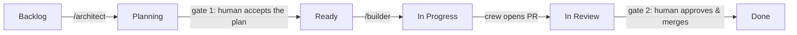

<p align="center">
  <picture>
    <source media="(prefers-color-scheme: dark)" srcset="assets/wordmark-dark.svg">
    
  </picture>
</p>

<p align="center"><em>The AI software factory for your repo.</em><br>
<sub>Agents build. People decide twice. Everything gets measured.</sub></p>

<p align="center">
  <a href="https://github.com/theam/facility/actions/workflows/ci.yml"></a>
  = 20">
  
</p>

---

Wiring an AI agent into a repository is now the easy part — GitHub will assign
an issue to one for you. Then the second month happens. The agent ships plans
instead of code because its environment can't run your tests. PRs merge on
vibes because the review step has no standard to enforce. And the failures are
the quiet kind: a dead trigger stops summoning agents, a mis-permissioned
review lane approves silence, and nothing turns red — because nobody watches
the watchmen. None of this is a model problem. It's a factory problem.

Facility installs the factory: an opinionated SDLC where agents plan, build,
review, repair, and security-sweep inside your GitHub repo — against a
**provisioned environment** so they verify for real, against a **written
standard** so review means something, with **deterministic guards** for rules
that should never depend on judgment, with **humans owning both gates** (plan
acceptance and the merge), and with a **watchtower** that measures whether
the work was actually accepted and goes red when the pipeline breaks.

Built by [The Agile Monkeys](https://theagilemonkeys.com) from the system we
run our own product engineering on — the one shown in our AI SDLC story:
*"We taught AI to ship like our engineers. Then we made it prove it."* The
[hardening notes](docs/hardening.md) are fifteen production scars, not a
threat model.

## Quickstart

```
npx @theam/facility init
```

A few questions (your default branch, your provision command, your check
commands, optional board, optional modules — model tiering defaults to
`opusplan` build · Sonnet review · Opus plan/repair/sweep) and it writes,
into *your* repo, with no runtime dependency on us:

```
.github/workflows/facility-crew.yml             /architect + /builder
.github/workflows/facility-review.yml           every PR reviewed against the standard
.github/workflows/facility-address-review.yml   human review → agent iterates
.github/workflows/facility-doctor.yml           failed checks → triage or bounded repair
.github/workflows/facility-security-sweep.yml   weekly audit → deduped, high-confidence issues
.github/workflows/facility-watchtower.yml       nightly outcomes + daily health, budgets enforced
.github/workflows/facility-canary.yml           weekly synthetic flight through the real pipeline
.github/facility/                               operating contracts + vendored watchtower/doctor scripts
STANDARD.md                                     your quality contract, binding for all
AGENTS.md · CLAUDE.md                           wired to the method (appended, never overwritten)
.claude/  (skills, commands, hooks, reviewers)  the craft while working, guardrails always
.agents/skills → .claude/skills                 same skills for non-Claude agents
guards/   (zero-dep runner + starter guards)    deterministic invariants, one CI status
.facility.json                                  the choices you made, for doctor/update
```

Then the steps only you can do — `init` prints them, `npx @theam/facility
doctor` checks them: create the `CLAUDE_CODE_OAUTH_TOKEN` secret
(`claude setup-token`), install the [Claude GitHub App](https://github.com/apps/claude),
protect your default branch.

Now open an issue and comment:

```
/architect
```

## How it works



One agent per stage of the lifecycle, each with its own contract and model
tier, all three prohibitions shared — never approve, never merge, never touch
protected branches:

| role | trigger | does | never |
|---|---|---|---|
| **/architect** | issue comment | plans against reality: reads code, runs real commands | commit, push, open PRs |
| **/builder** | issue/PR comment | implements end to end, runs your checks, opens the PR | merge, defer, ship "phase 1" |
| **reviewer** | every non-draft PR | reviews against `STANDARD.md`, inline comments | approve, merge |
| **addresser** | human submits a review | fixes actionable feedback, re-verifies, replies point by point | act on praise, resolve threads |
| **doctor** | a watched check fails | deterministic triage; bounded repair on crew PRs only | touch security surfaces, human branches |
| **sweep** | weekly | correlates scanner alerts with reachable code, files deduped issues | edit anything |

And the layer the off-the-shelf kits don't have — **the watchtower**
([docs/watchtower.md](docs/watchtower.md)): nightly agent-PR outcomes
(acceptance, one-shot rate, human fixups) on a dashboard issue, a daily
health monitor with per-workflow budgets that goes red on breach, and a
weekly canary that flies a synthetic `/architect` probe through the real
pipeline — authorized by message hash, so a leaked key can at worst replay
one fixed read-only probe. The whole layer reads only the GitHub API and is
pinned by its own guard. On the production system it generalizes, the
canary's first flight caught a real pipeline bug.

The full reasoning — why one-shot delivery, why the architect exists, why the
board only moves forward — is in [docs/method.md](docs/method.md).

## The opinions

Facility is opinionated so your team doesn't renegotiate these weekly. Every
one is structural — in prompts, hooks, workflows, guards, or GitHub settings
— not aspirational:

1. **Agents never approve, never merge, never touch protected branches.**
   People decide twice; the merge is where accountability lives.
2. **Provision before prompting.** An agent that can't run your tests will
   hedge; the environment is the fix, not a sterner prompt.
3. **One-shot delivery.** The builder finishes or names the concrete blocker.
4. **One standard for humans and agents.** `STANDARD.md` at the root, cited
   in reviews, read before work.
5. **Prose rules graduate to guards.** Missed twice → deterministic check.
6. **All repo-originated text is untrusted data.** Issues, PRs, reviews,
   logs — framed as data in every contract, kept out of every shell. Bots
   never summon agents; the canary's one exception is authorized by message
   hash, not by sender.
7. **Everything is vendored.** After `init`, every file is yours. The CLI is
   an installer, not a framework.
8. **Everything gets measured.** Acceptance is a nightly metric, budgets are
   a reviewed file, and the watchtower cannot quietly rot — it's locked by a
   guard. Numbers straight from the pipeline, never curated for a slide.

## Modules

Concerns beyond the core ship as modules — each packages a concern in every
form a rule needs to hold: a `STANDARD.md` section, a reviewer subagent,
guards/hooks, and the slash commands for its workflows.

```
npx @theam/facility add database
```

| module | enforces |
|---|---|
| `database` | migrations append-only + collision-free versions (guards + hook), access-control-by-default |
| `analytics` | new features ship privacy-safe analytics; missing events are correctness bugs |
| `ai-queryability` | durable data is reachable by your product's AI surfaces — or the waiver is written down |
| `design-system` | UI conforms to *your* design system; flows carry browser evidence |

Write your own by copying any module's shape — see [modules/](modules/README.md).

## Where it sits

| | gives you | doesn't give you |
|---|---|---|
| [Agent HQ](https://github.blog/news-insights/company-news/pick-your-agent-use-claude-and-codex-on-agent-hq/) / assign-to-agent | an agent on an issue, fast | provisioned verification, a standard, guards, human gates, self-observation |
| [gh-aw](https://github.github.com/gh-aw/) | markdown → hardened workflows (mechanism) | an SDLC method; opinions about quality, measurement, and what humans own |
| [claude-code-action](https://github.com/anthropics/claude-code-action) raw | the execution substrate (facility uses it) | everything above it — which is this repo |
| **facility** | the factory: roles + gates + standard + guards + provisioned env + watchtower + 15 hardening scars | an excuse to stop reading your crew's PRs |

Honest scope: today the crew runs on Claude via `claude-code-action`; the
engine field in `.facility.json` exists because that shouldn't be a forever
assumption. The production system this generalizes also runs a parallel Codex
lane under the same guardrails — engine choice as evidence, not folklore —
and that lane is the first roadmap item.

## Status & roadmap

**v0.2 — private preview.** File layout may still move. Roadmap, in order:
per-run **receipts** (tokens, cost, duration — feeding real cost SLOs into
the health monitor), the **pattern miner** (recurring failures → proposed
guards), a second engine lane (Codex) behind the same contracts,
`facility update` (re-sync vendored files, three-way), and a `validate` role
for triaging user-reported issues against a live environment.

## Docs

- [The method](docs/method.md) — the loop, the roles, the two human gates
- [The watchtower](docs/watchtower.md) — the SDLC watching itself
- [Hardening notes](docs/hardening.md) — fifteen things production taught us
- [Guards](docs/guards.md) — deterministic checks, allowlists with reasons
- [FAQ](docs/faq.md) — positioning, costs, non-Node stacks
- [Contributing](CONTRIBUTING.md) · [Security policy](SECURITY.md)

---

<p align="center">
  <br>
  <sub>An initiative by <a href="https://theagilemonkeys.com">The Agile Monkeys</a></sub>
</p>
